# 🤖 Cal-AI — Retrieval Augmented Generation System

> Ask questions about **The Calcutta University Act 1979** and **Ph.D Regulations 2025** and get intelligent, document-grounded answers powered by Groq's LLM and local embeddings.

---

## 📌 What is this?

Cal-AI is a RAG (Retrieval Augmented Generation) system. It reads your PDF documents, stores their meaning in a vector database, and lets you query them in plain English. Instead of keyword search, it *understands* your question and finds the most relevant passages to answer it.

Embeddings run locally via Ollama. LLM inference is handled by **Groq** (cloud) so an internet connection is required for answering queries.

---

## 🏗️ Architecture




---

## 📁 Project Structure

```
project/
│
├── vector.py          # Reads PDFs, creates chunks, builds ChromaDB
├── rag.py             # RAG chain — retriever + LLM + prompt
├── main.py            # FastAPI server — /health and / endpoints
└── streamlit_app.py   # Frontend UI
```

---

## 🔍 File Breakdown

### `vector.py` — Building the Knowledge Base

This file runs once to process your PDF documents and store them as vectors.

- Loads PDFs using **Docling** — a powerful document parser that handles complex layouts, tables, and headings far better than basic PDF readers
- Chunks documents using **HybridChunker** with the `nomic-embed-text` tokenizer — keeping chunks within the 1024 token context limit while preserving semantic meaning
- Converts chunks into **vector embeddings** using `OllamaEmbeddings` with the `nomic-embed-text` model
- Stores everything in **ChromaDB** at `./vector_database`

On subsequent runs, if the database already exists, it simply loads it — no reprocessing needed.

---

### `rag.py` — The Brain

This file wires the retriever to the LLM to form the complete question-answering chain.

- Imports the `retriever` from `vector.py` — configured to fetch the **top 7 most relevant chunks** per query
- Uses **Groq's llama-3.3-70b-versatile** as the LLM — fast, accurate, and free to use
- Builds a **LangChain RetrievalQA chain** that:
  1. Embeds your question
  2. Searches ChromaDB for relevant document passages
  3. Feeds those passages + your question into the LLM
  4. Returns a grounded, document-based answer

---

### `main.py` — The API Layer

FastAPI server that exposes the RAG system over HTTP so n8n and Streamlit can talk to it.

**`GET /health`** — lightweight status check
```json
{ "status": "ready", "vectordb_ready": true }
```
Returns whether the vector database has finished loading. Streamlit polls this every 2 seconds on startup so users can't query before the system is ready.

**`POST /`** — the main query endpoint
```json
Request:  { "query": "What is DPAC?" }
Response: { "query": {...}, "response": { "content": "DPAC stands for..." } }
```

Uses FastAPI's `lifespan` to ensure ChromaDB is fully loaded before accepting any requests.

---

### `streamlit_app.py` — The Interface

A clean browser-based UI for querying the system.

- On startup, polls `/health` every 2 seconds and shows a spinner until the system is ready
- Once ready, presents a text area for questions
- Sends queries to the **n8n webhook** (not directly to FastAPI) — n8n acts as the orchestration layer
- Displays the LLM's answer in a styled response box

---

## ⚙️ Tech Stack

| Component | Technology |
|---|---|
| Document parsing | Docling |
| Chunking | HybridChunker + nomic tokenizer |
| Embeddings | Ollama — nomic-embed-text |
| Vector database | ChromaDB |
| LLM | Groq — llama-3.3-70b-versatile |
| RAG framework | LangChain |
| API server | FastAPI + Uvicorn |
| Orchestration | n8n (Docker) |
| Frontend | Streamlit |

---

## 🚀 How to Run

### Prerequisites

- Python 3.10+
- Ollama installed and running (`ollama pull nomic-embed-text`)
- Docker Desktop (for n8n)
- A Groq API key — free at [console.groq.com](https://console.groq.com)

---

### Step 1 — Install dependencies

```bash
# Create and activate virtual environment
python -m venv venv
venv\Scripts\activate        # Windows
source venv/bin/activate     # Mac/Linux

# Install packages
pip install -r requirements.txt
```

---

### Step 2 — Start n8n or if you do not want to use n8n

For that in the streamlit_app.py file instread of API_URL = "http://localhost:5678/webhook/rag-query"
use API_URL = "http://127.0.0.1:8000/" then you can omit the below step for n8n.

```bash
# Using Docker
docker run -it --rm --name n8n -p 5678:5678 docker.n8n.io/n8nio/n8n

# OR using npx
npx n8n
```

Open `http://localhost:5678` and set up the workflow (see n8n Setup below).

---

## 🔧 n8n Workflow Setup (Omit if you do not want to use n8n)

Create a workflow with 3 nodes connected in a straight line:

**Node 1 — Webhook**
- Method: `POST`
- Path: `rag-query`
- Respond: `Using Respond to Webhook Node`

**Node 2 — HTTP Request**
- Method: `POST`
- URL: `http://host.docker.internal:8000/` (Docker) or `http://127.0.0.1:8000/` (npx)
- Body: JSON with field `query` = `{{ $json.body.query }}`

**Node 3 — Respond to Webhook**
- Respond With: `JSON`
- Response Body (Expression mode): `{{ $json }}`
- Response Code: `200`

Click **Publish** to activate.

### Step 3 — Start FastAPI

```bash
uvicorn main:app --host 0.0.0.0 --port 8000 --reload
```

On first run this will process your PDFs and build the vector database — this takes a few minutes. Subsequent starts load the existing database instantly.

---

### Step 4 — Start Streamlit

```bash
streamlit run streamlit_app.py
```

Open `http://localhost:8501` in your browser. Wait for the ✅ ready message, then start querying.

---

### Step 5 — Start Ollama in background
Open Terminal then run
```bash
ollama list
```
---

## 💬 Example Queries

```
What is DPAC and what role does it play in the Ph.D program?

Who is eligible to attend the Viva-Voce examination?

What are the powers of the Calcutta University Senate under the 1979 Act?

What are the registration requirements for a Ph.D student at Calcutta University?
```

---

## 📝 Notes

- The vector database is created at `./vector_database` — delete this folder to force a full rebuild from your PDFs
- PDF files should be placed in the `Data/` folder before first run
- The system only answers based on your uploaded documents — it will not hallucinate information outside them
- n8n runs in Docker so use `host.docker.internal` instead of `127.0.0.1` in the HTTP Request node URL

---

## 👨‍💻 Built With

- [LangChain](https://langchain.com) — RAG orchestration
- [Docling](https://github.com/DS4SD/docling) — PDF parsing
- [ChromaDB](https://trychroma.com) — vector storage
- [Ollama](https://ollama.ai) — local embeddings
- [Groq](https://groq.com) — LLM inference
- [FastAPI](https://fastapi.tiangolo.com) — API framework
- [n8n](https://n8n.io) — workflow automation
- [Streamlit](https://streamlit.io) — frontend UI
